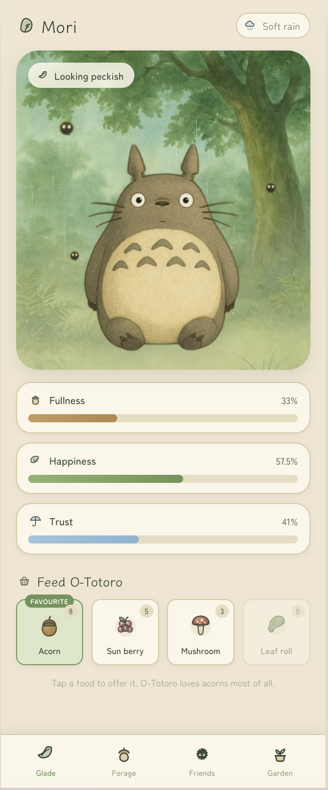
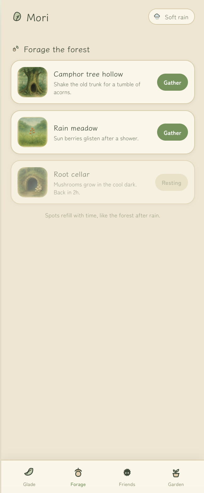
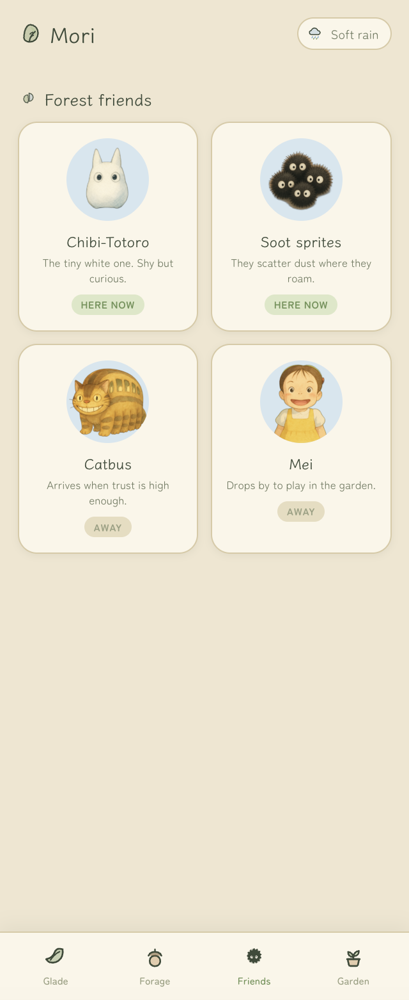

<div align="center">
  
</div>

# Woven

Toss Woven an idea. Get a whole app back, drawn live on the canvas. Every illustration, every screen, every shader lands as its own node, so you can noodle on one, riff on another, branch off a weird take, or just trash the lot and try again. Freeform generation, freeform editing, pure chaos.

Each kind of visual has its own pipeline. Raster portraits get generated and cut out. Shaders stay GLSL. Vectors stay paths. Particles, Lottie, and 3D each have their own subagent. The result reads as drawn.

The output is real. Plain HTML, CSS, and JS in `source/`. Opens by double-clicking. Emails to a designer who's never heard of Woven.

You bring the agent (Claude Code, Codex, or an API key). Woven is the canvas around it.

This README walks through your first run end-to-end, from install to the Ghibli-themed Totoro feeder app at the bottom, generated from one prompt.

---

## Table of contents

1. [What you need before starting](#1-what-you-need-before-starting)
2. [Install](#2-install)
3. [Start the editor](#3-start-the-editor)
4. [First-run onboarding: the 5-step setup wizard](#4-first-run-onboarding-the-5-step-setup-wizard)
5. [Step 1 · connect a model](#5-step-1--connect-a-model)
6. [Step 2 · add asset-provider keys (image · video · SVG)](#6-step-2--add-asset-provider-keys-image--video--svg)
7. [Step 3 · review orchestrators](#7-step-3--review-orchestrators)
8. [Step 4 · install local skills (rembg)](#8-step-4--install-local-skills-rembg)
9. [Create your first project](#9-create-your-first-project)
10. [Open the workflow and send your first prompt](#10-open-the-workflow-and-send-your-first-prompt)
11. [The final prototype](#11-the-final-prototype)

---

## 1. What you need before starting

You only need four things on your machine:

| Requirement      | Why                                                                          | How to check                          |
| ---------------- | ---------------------------------------------------------------------------- | ------------------------------------- |
| **Python 3.9+**  | The editor daemon (`serve.py` + sibling modules) is pure Python, stdlib only. 3.9 is the floor (matches the system `python3` on a clean macOS). | `python3 --version`                   |
| **A modern browser** | Chrome, Edge, Safari, or Firefox (anything from the last ~2 years).      | (no command, just open it)            |
| **One of:** Claude Code CLI · Codex CLI · an Anthropic / OpenAI API key | The editor needs at least one way to reach a text model so the agent can run workflows. **The CLI is the required path for agentic workflows** (a pasted API key only powers single-shot "simple prompt" nodes). You'll wire this up in [Step 1](#5-step-1--connect-a-model). | `claude --version` / `codex --version` |
| **`rembg`**      | Background-removal step in the `raster-foreground` asset pipeline (characters / mascots / isolated subjects). One-click install from the onboarding card, or `pip3 install --user rembg`. First install pulls ~170 MB of model weights. | `python3 -c "import rembg; print(rembg.__version__)"` |

You do **not** need Node, npm, Docker, or a build step. The editor ships as static HTML + a set of pure-Python files (stdlib only, no third-party packages).

---

## 2. Install

```bash
# 1. Clone (or download a zip and unpack)
git clone https://github.com/heysami/Woven.git
cd Woven

# 2. (Optional) install one of the supported CLIs.
#    Pick ONE. You only need one connection path to a model.
npm install -g @anthropic-ai/claude-code   # Claude Code
# or
npm install -g @openai/codex               # Codex

# 3. Sign in once so the CLI has a session
claude login    # (if you installed Claude Code)
# or
codex login     # (if you installed Codex)
```

If you'd rather paste an API key instead of installing a CLI, skip the `npm install` step; you'll paste the key in the onboarding UI in [Step 1](#5-step-1--connect-a-model). Note that a key alone runs **simple prompt** nodes only - agentic workflows (node runs, chat, orchestrators) still need a CLI.

---

## 3. Start the editor

From the repo root:

```bash
# macOS: double-click in Finder
open editor/serve.command

# any platform: from a terminal
python3 editor/serve.py
```

The daemon prints the URL it's listening on (default **http://localhost:5731/editor/**) and a Finder window / browser tab opens automatically.

To run with a separate workspace folder (multi-project mode), set `TH_WORKSPACE_DIR`:

```bash
TH_WORKSPACE_DIR="$HOME/my-prototypes" python3 editor/serve.py
```

---

## 4. First-run onboarding: the 5-step setup wizard

On the very first launch, the **Projects** page shows a setup card. The top-right pill reads **No model configured** in red - your cue that nothing will run until you wire up a connection. While anything required is still missing, the **+ New project** button stays disabled.

The card is a single wizard with five numbered pips across the top:

**1 Agent model · 2 Asset keys · 3 Orchestrators · 4 Local skills · 5 Done**

Click any pip to jump to that step, or use **← Back / Next →** at the bottom. Only **Step 1 (a CLI)** and **Step 4 (rembg)** are required gates; Steps 2 and 3 are optional and never block. The next five sections walk through each step.

---

## 5. Step 1 · connect a model


Step 1 wires up the model the agent runs on. There are two paths, and they are **not** equivalent:

### 5a · Install a CLI (required for agents)

A **Claude Code or Codex CLI on your `PATH` is the required backend.** The agent loop, file tools, and context compaction all live in the CLI harness, so node runs, chat, and orchestrators only work once a CLI is connected.

Click **Install a CLI** to open the **Install a model CLI** popup. It lists both supported binaries with copy-paste install + login commands:


Run the commands, then click **I've installed it · refresh** (or **I've already set one up · refresh** on the step itself). The status dot flips to green.

### 5b · Paste an API key (simple prompts only)

Click **Paste an API key** to drop in an Anthropic or OpenAI key via Settings. The key is stored locally at `~/.test-harness/media-config.json` (file mode `0600`, never sent anywhere except the provider's own API).

A key on its own runs **single-shot "simple prompt" nodes** only - it does **not** enable agentic workflows. If you finish onboarding on a key alone, the top-right pill turns amber and reads **Agents disabled - no CLI** as a standing nudge to install one.

---

## 6. Step 2 · add asset-provider keys (image · video · SVG)

Step 1 only covers the **agent's text model**. To unlock image generation, video, vector SVG, audio, etc., add the relevant provider keys in **Step 2**:


Each row shows what the provider covers and lets you paste a key inline, no need to leave the page:

| Provider     | Covers                                                              | Where to get a key                                       |
| ------------ | ------------------------------------------------------------------- | -------------------------------------------------------- |
| **fal.ai**   | image · video · 3D · background removal · upscale (one key, many skills) | https://fal.ai/dashboard/keys                       |
| **Quiver AI**| vector SVG generation                                              | https://docs.quiver.ai/getting-started/quickstart        |
| **OpenAI**   | raster image (`gpt-image-2`) · text models                          | https://platform.openai.com/api-keys                     |
| **Anthropic**| Claude text models · vision-based describe                          | https://console.anthropic.com/settings/keys              |

These are **optional**. Projects can still be created without them; you just won't be able to run the matching skill nodes (image-generate, video-gen, svg-gen, etc.) until the key is in place. You can always come back later via the **gear icon** in the top-right.

---

## 7. Step 3 · review orchestrators

**Step 3** is a new, optional review step. Orchestrators dispatch whole families of subagents for richer artefacts (photography, illustration, simulations, 3D scenes, motion studios, and so on). Each row has a toggle, so you can turn off any family you don't want auto-dispatched - you can still invoke them by name later.


Rows whose pipeline depends on a key you haven't set in Step 2 are shown as **limited** with a short note about what's missing. Nothing here blocks project creation; if in doubt, leave the defaults and click **Next →**.

---

## 8. Step 4 · install local skills (rembg)

The wizard's **Step 4 · Local skills** lists Python packages the daemon will install into your user site (`pip install --user`). **`rembg` is the one required entry**: it's the background-removal step in the `raster-foreground` asset pipeline (every character, mascot, or isolated subject runs through it on the way to the canvas). Skip it and foreground asset generation falls over at the cutout stage.


Click **Install rembg** and give it a minute. First install pulls ~170 MB of ONNX model weights.

If you'd rather drop down to the terminal:

```bash
pip3 install --user rembg
```

Optional packages (for `particle-gl`, `3d`, etc.) can wait. Install them from the gear icon → Settings when the matching pipeline first asks for them.

Once the required steps are satisfied, **Step 5 · Done** confirms you're set (**"All set!"** when a CLI is connected, or **"Continue without agents"** if you finished on a key alone). Dismiss the card and the **+ New project** button lights up.

---

## 9. Create your first project

Once a model is configured and rembg is installed, the top-right warning pill disappears, the daemon + CLI chips both go green, and the **+ New project** button lights up. The header carries tabs for **Projects** (your gallery), **Shares**, and **Capabilities** (a bundled reference for the orchestrators, skills, subagents, and node kinds the editor ships with), reachable from anywhere on the landing.


Click **+ New project** (or **+ Create your first project** in the empty state - the caret next to it also offers **From GitHub…** to clone an existing repo). The new-project modal opens:


It has three things on it:

- **Project name** - type a folder-safe id (alphanumeric + `.` `_` `-`); the modal echoes the slug it will use.
- **Export folder** (optional) - where per-asset Export (the ⤓ on a selected node) drops bundles. On macOS a **Pick…** button opens Finder; you can also change this later from the **Exports** button in the workflow toolbar.
- **Start from the template design system** (toggle, off by default) - seed a tokenized component library you can recolour, round, and retype.

With the toggle **off**, click **+ Create** and you land straight on a clean workflow canvas - no scope picker, no multi-step wizard. The earlier "Blank / Quick designs / Design system / PRD only / Full guided / Custom" branching was removed; every fresh project starts blank and you tell the agent what you want from chat. Need one of the old guided runs? Just ask the agent in plain English on the next screen ("brainstorm three design directions", "write a PRD first", "do the full guided flow", …) and the orchestrator skill picks the right stages.

With the toggle **on**, the button reads **Customize →** and advances to a wider **design-system customizer** step - a live preview where you tune colour, roundness, type, and spacing before the project is created with that tokenized DS baked in.

---

## 10. Open the workflow and send your first prompt

The editor drops you into **workflow mode**. The left sidebar is the **Library** of node types (basic tools, asset generators, iterators, and more…). In the middle of the empty canvas, the editor shows a **"Your workflow is empty"** card with a composer right where you need it. No menus to open, no drawers to expand.


Type your prompt into the composer. The agent has read/edit/bash access to your project root and will scaffold the prototype from scratch. For this walkthrough we'll use:

> `create a ghibli themed mobile app to feed totoro`


Press **⌘/Ctrl + Enter** (or click **Send**) and the agent gets to work, generating the design system, scaffolding pages, dispatching asset jobs, and wiring everything together as nodes on the canvas in real time.

---

## 11. The final prototype

After the agent finishes the run, the workflow canvas fills out with every step that produced the prototype: a column of **Prompt** nodes (one per illustrated subject: Totoro himself, soot sprites, Chibi-Totoro, the Catbus…), each feeding a **Generate image** node, then a **Remove background** node that pipes the cleaned PNG into the final page rendering on the right. The chat drawer streams the agent's tool calls live (Read / Write / Bash) as it scaffolds files into `source/`. The right-most frame is the live phone-mockup of the Ghibli-themed Totoro feeder app, sitting inside the canvas alongside the assets that built it.


From here you can switch to the **Prototype viewer** (the right-side nav-rail button) to browse the full app in browser-style tabs outside the canvas, or re-run any individual asset node (the **▶ Run** control on the node) to regenerate a single illustration without redoing the whole flow.

### What the agent generated from a single prompt

The one-line prompt, *"create a ghibli themed mobile app to feed totoro"*, produced a four-tab app named **Mori**, with a watercolor Ghibli palette, soft-rain weather chip, and consistent illustration style across every screen:

| Glade · feed Totoro | Forage · gather food | Friends · forest companions |
| :---: | :---: | :---: |
|  |  |  |
| Totoro idles in a rainy clearing; three stat bars (**Fullness · Happiness · Trust**) drive a food picker (Acorn the favourite, Sun berry, Mushroom, Leaf roll) with live counts and a hint that O-Totoro loves acorns most. | A list of refilling foraging spots (**Camphor tree hollow · Rain meadow · Root cellar**) with painted location thumbnails and a "Resting · Back in 2h" cooldown on the cellar. Spots regrow over time. | A grid of Ghibli companions (**Chibi-Totoro · Soot sprites · Catbus · Mei**) each with a Here-now / Away presence chip; Catbus and Mei unlock as trust climbs. |

Bottom-tab navigation, the **Mori** wordmark, and the **Soft rain** weather chip carry across every screen. The agent inferred a consistent design system (cream background, sage green accent, hand-drawn icons) from the single prompt and applied it uniformly.

---

## Troubleshooting

| Symptom                                              | Fix                                                                                                    |
| ---------------------------------------------------- | ------------------------------------------------------------------------------------------------------ |
| Top-right pill stays red after pasting a key         | Click the **gear icon → Test** on that provider row in Settings to verify the key.                     |
| **CLI missing** chip is amber                        | `which claude`. If empty, run `npm install -g @anthropic-ai/claude-code` then `claude login`.          |
| **Daemon down** chip is red                          | The Python server crashed or was stopped. Re-run `python3 editor/serve.py` from the repo root.         |
| Port 5731 already in use                             | Set a different port: `EDITOR_PORT=5740 python3 editor/serve.py`.                                      |
| Image / video / SVG nodes fail with "no API key"     | Open **Settings (gear)** and add the relevant provider key (see [Step 2](#6-step-2--add-asset-provider-keys-image--video--svg)). |

---

## Where things live on disk

```
<workspace-dir>/
├── workspace.json                  # project registry (auto-managed)
├── projects/
│   └── <project-id>/
│       ├── source/                 # the generated prototype HTML/CSS/JS lives here
│       ├── editor/data.js          # canvas state (frames, nodes, arrows)
│       └── workflow/workflow.json  # workflow graph
└── design-systems/
    └── <ds-id>/                    # reusable design systems shared across projects

~/.test-harness/media-config.json   # your provider API keys (mode 0600, per-user)
```

That's it. You're set up.
