<div align="center">
  
</div>

# Woven

Toss Woven an idea. Get a whole app back, drawn live on the canvas. Every illustration, every screen, every shader lands as its own node, so you can noodle on one, riff on another, branch off a weird take, or just trash the lot and try again. Freeform generation, freeform editing, pure chaos.

Each kind of visual has its own pipeline. Raster portraits get generated and cut out. Shaders stay GLSL. Vectors stay paths. Particles, Lottie, and 3D each have their own subagent. The result reads as drawn.

The output is real. Plain HTML, CSS, and JS in `source/`. Opens by double-clicking. Emails to a designer who's never heard of Woven.

You bring the agent (Claude Code, Codex, opencode, or an API key). Woven is the canvas around it.

This README walks through your first run end-to-end, from install to the Ghibli-themed Totoro feeder app at the bottom, generated from one prompt.

---

## Table of contents

1. [What you need before starting](#1-what-you-need-before-starting)
2. [Install](#2-install)
3. [Start the editor](#3-start-the-editor)
4. [First-run onboarding: the 5-step setup wizard](#4-first-run-onboarding-the-5-step-setup-wizard)
5. [Step 1 · connect a model](#5-step-1--connect-a-model)
6. [Step 2 · add asset-provider keys (image · video · SVG)](#6-step-2--add-asset-provider-keys-image--video--svg)
7. [Step 3 · review orchestrators](#7-step-3--review-orchestrators)
8. [Step 4 · install local skills](#8-step-4--install-local-skills)
9. [Create your first project](#9-create-your-first-project)
10. [Open the workflow and send your first prompt](#10-open-the-workflow-and-send-your-first-prompt)
11. [The final prototype](#11-the-final-prototype)

---

## 1. What you need before starting

There are **three things to launch the editor**, plus **four local skills** the first-run wizard installs for you (these gate project creation, see [Step 4](#8-step-4--install-local-skills)). The three launch requirements:

| Requirement      | Minimum                                              | Why                                                                          | How to check                          |
| ---------------- | --------------------------------------------------- | ---------------------------------------------------------------------------- | ------------------------------------- |
| **Python**       | **3.9 or newer**                                    | The editor daemon (`serve.py` + sibling modules) is pure Python, stdlib only. 3.9 is the floor (it matches the system `python3` on a clean macOS); 3.11+ is fine and what most dev machines already have. | `python3 --version`                   |
| **A modern browser** | Chrome / Edge / Safari / Firefox, last ~2 years | Renders the editor UI. The daemon serves it; the browser is just the front-end. | (no command, just open it)            |
| **A model connection** | **one of:** Claude Code CLI · Codex CLI · opencode CLI · an Anthropic / OpenAI API key | At least one way to reach a text model so the agent can run workflows. **A CLI is the required path for agentic workflows** (a pasted API key only powers single-shot "simple prompt" nodes). You'll wire this up in [Step 1](#5-step-1--connect-a-model). | `claude --version` / `codex --version` / `opencode --version` |

The **editor itself** has no build step; it ships as static HTML + pure-Python files (stdlib only). But the four required local skills below bring their own tooling: two install via **Homebrew** and one via **npm**, so for a complete setup you also need **[Homebrew](https://brew.sh)** (macOS/Linux) and **[Node.js](https://nodejs.org)** on your machine.

### Local skills the wizard installs (Step 4)

On first run the onboarding wizard installs four local skills the asset / sharing / shader pipelines depend on. **All four are required gates**: the **+ New project** button stays disabled until every one is present. The wizard installs them **automatically** when its Step 4 opens - each row shows live install progress; a skill whose prerequisite is missing (Homebrew / Node.js) waits with a hint and a manual Install button instead.

| Skill            | Installs via                          | Prereq    | Covers                                                                 |
| ---------------- | ------------------------------------- | --------- | --------------------------------------------------------------------- |
| **rembg**        | pip (`pip3 install --user rembg`)     | Python    | background removal in the `raster-foreground` pipeline; ~170 MB model on first use |
| **cloudflared**  | Homebrew (`brew install cloudflared`) | Homebrew  | Share-mode quick tunnels (publish a prototype for review / multiplayer) |
| **glslang**      | Homebrew (`brew install glslang`)     | Homebrew  | GLSL compile-check for the post-run shader lint                       |
| **shader-verify**| npm + a Chromium download             | Node.js   | headless render-check (shader compiles AND isn't blank); ~150 MB Chromium |

On Windows (no Homebrew), install `cloudflared` and `glslang` from their own releases (winget / scoop / the project download pages) before finishing onboarding.

### If your Python is too old (below 3.9)

Check first:

```bash
python3 --version
```

If it prints **3.8 or lower** (or `python3` isn't found), install a newer one. You don't have to remove the old Python; just make a 3.9+ interpreter available:

- **macOS** - the system `python3` is usually 3.9 already. If yours is older, install via [Homebrew](https://brew.sh): `brew install python@3.12`, or grab the installer from [python.org/downloads](https://www.python.org/downloads/).
- **Windows** - install from [python.org/downloads](https://www.python.org/downloads/) (tick **"Add python.exe to PATH"** in the installer), or `winget install Python.Python.3.12`.
- **Linux** - use your package manager (`sudo apt install python3` / `sudo dnf install python3`), or [pyenv](https://github.com/pyenv/pyenv) if your distro's version is stuck below 3.9.

Then launch the daemon with the newer interpreter explicitly if `python3` still points at the old one - e.g. `python3.12 editor/serve.py`. Everything is stdlib only, so there is nothing else to install for the daemon itself.

---

## 2. Install

```bash
# 1. Clone (or download a zip and unpack)
git clone https://github.com/heysami/Woven.git
cd Woven

# 2. (Optional) install one of the supported CLIs.
#    Pick ONE. You only need one connection path to a model.
npm install -g @anthropic-ai/claude-code   # Claude Code
# or
npm install -g @openai/codex               # Codex
# or
brew install sst/tap/opencode              # opencode (multi-provider) - or: npm i -g opencode-ai

# 3. Sign in once so the CLI has a session
claude login         # (if you installed Claude Code)
# or
codex login          # (if you installed Codex)
# or
opencode auth login  # (if you installed opencode - then `opencode models` to pick a default)
```

opencode is a multi-provider harness: it manages its own auth and default model, so after `opencode auth login` you connect any provider it supports (Anthropic, OpenAI, etc.) and Woven shells out to it for text-output runs.

If you'd rather paste an API key instead of installing a CLI, skip the `npm install` step; you'll paste the key in the onboarding UI in [Step 1](#5-step-1--connect-a-model). Note that a key alone runs **simple prompt** nodes only - agentic workflows (node runs, chat, orchestrators) still need a CLI.

---

## 3. Start the editor

From the repo root:

```bash
# macOS: double-click in Finder
open editor/serve.command

# any platform: from a terminal
python3 editor/serve.py
```

The daemon prints the URL it's listening on (default **http://localhost:5731/editor/**) and a Finder window / browser tab opens automatically.

To run with a separate workspace folder (multi-project mode), set `TH_WORKSPACE_DIR`:

```bash
TH_WORKSPACE_DIR="$HOME/my-prototypes" python3 editor/serve.py
```

---

## 4. First-run onboarding: the 5-step setup wizard

On the very first launch, the **Projects** page shows a setup card. The top-right pill reads **No model configured** in red - your cue that nothing will run until you wire up a connection. While anything required is still missing, the **+ New project** button stays disabled.

The card is a single wizard with five numbered pips across the top:

**1 Agent model · 2 Asset keys · 3 Orchestrators · 4 Local skills · 5 Done**

Click any pip to jump to that step, or use **← Back / Next →** at the bottom. Only **Step 1 (a CLI)** and **Step 4 (the four local skills)** are required gates; Steps 2 and 3 are optional and never block. The next five sections walk through each step.

---

## 5. Step 1 · connect a model

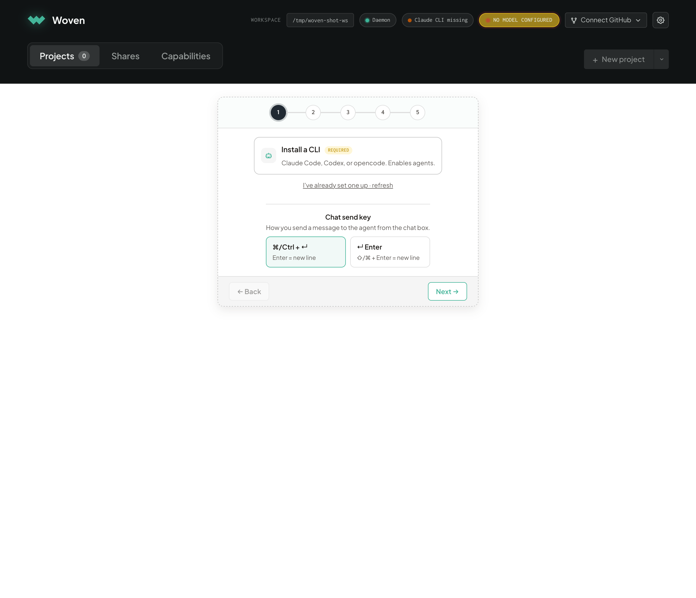

Step 1 wires up the model the agent runs on. There are two paths, and they are **not** equivalent:

### 5a · Install a CLI (required for agents)

A **Claude Code, Codex, or opencode CLI on your `PATH` is the required backend.** The agent loop, file tools, and context compaction all live in the CLI harness, so node runs, chat, and orchestrators only work once a CLI is connected.

Click **Install a CLI** to open the **Install a model CLI** popup. It lists all three supported binaries (Claude Code, Codex, opencode) with copy-paste install + login commands:

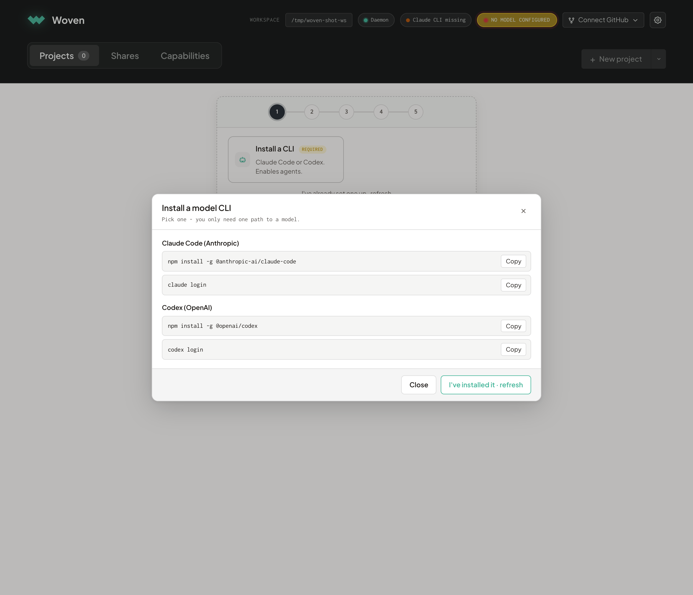

Run the commands, then click **I've installed it · refresh** (or **I've already set one up · refresh** on the step itself). The status dot flips to green.

### 5b · Paste an API key (simple prompts only)

Click **Paste an API key** to drop in an Anthropic or OpenAI key via Settings. The key is stored locally at `~/.test-harness/media-config.json` (file mode `0600`, never sent anywhere except the provider's own API).

A key on its own runs **single-shot "simple prompt" nodes** only - it does **not** enable agentic workflows. If you finish onboarding on a key alone, the top-right pill turns amber and reads **Agents disabled - no CLI** as a standing nudge to install one.

---

## 6. Step 2 · add asset-provider keys (image · video · SVG)

Step 1 only covers the **agent's text model**. To unlock image generation, video, vector SVG, audio, etc., add the relevant provider keys in **Step 2**:

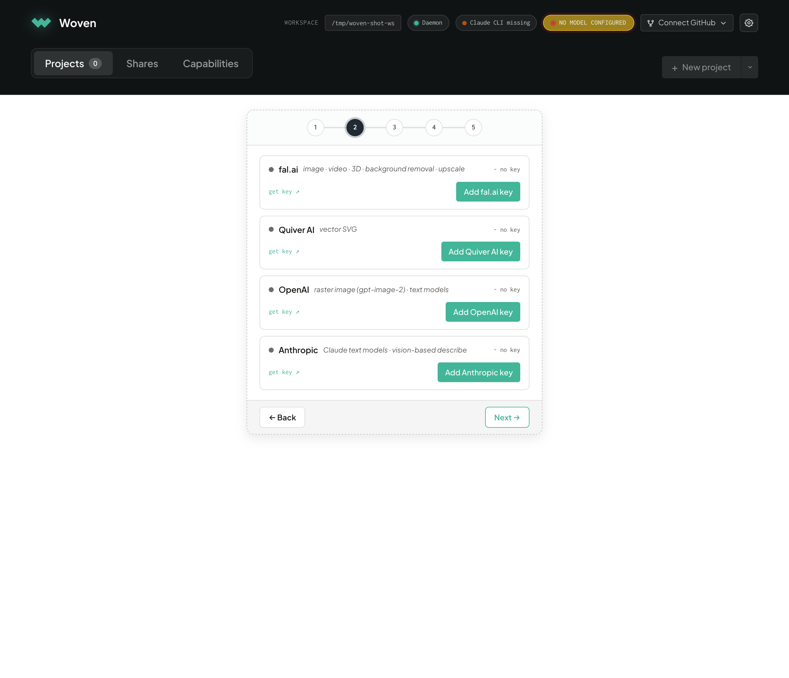

Each row shows what the provider covers and lets you paste a key inline, no need to leave the page:

| Provider      | Covers                                                              | Where to get a key                                       |
| ------------- | ------------------------------------------------------------------- | -------------------------------------------------------- |
| **fal.ai**    | image · video · 3D · background removal · upscale (one key, many skills) | https://fal.ai/dashboard/keys                       |
| **Quiver AI** | vector SVG generation                                              | https://docs.quiver.ai/getting-started/quickstart        |
| **OpenAI**    | raster image (`gpt-image-2`) · text models                          | https://platform.openai.com/api-keys                     |
| **Anthropic** | Claude text models · vision-based describe                          | https://console.anthropic.com/settings/keys              |
| **ElevenLabs**| audio - voiceover · sound effects · music (one key, all three)      | https://elevenlabs.io/app/settings/api-keys              |
| **Meshy**     | 3D - text/image to textured `.glb`                                  | https://docs.meshy.ai/                                   |
| **Exa**       | web search for the Research assistant                               | https://dashboard.exa.ai/api-keys                        |

These are **optional**. Projects can still be created without them; you just won't be able to run the matching skill nodes (image-generate, video-gen, svg-gen, audio-gen, 3D, web-search, etc.) until the key is in place. You can always come back later via the **gear icon** in the top-right. A handful of additional providers (xAI, BFL, Recraft, Leonardo, Higgsfield, and more) are available from that same Settings panel.

---

## 7. Step 3 · review orchestrators

**Step 3** is an optional review step. Orchestrators dispatch whole families of subagents for richer artefacts. The editor ships **17** of them, auto-discovered from their manifests, so the list stays current as new ones land:

- **Art direction & assets** - Art Director, Visual, Photography, Illustration, Illustrative shaders, Creative visual, Material
- **Immersive & interactive** - Simulation, Narrative experience, Game experience, Interactive media, Motion Studio, Scrapbook experience
- **3D** - Scene 3D, Hero 3D
- **Polish & ship** - Interactive polish, Publish

Each row has a toggle, so you can turn off any family you don't want auto-dispatched - you can still invoke them by name later.

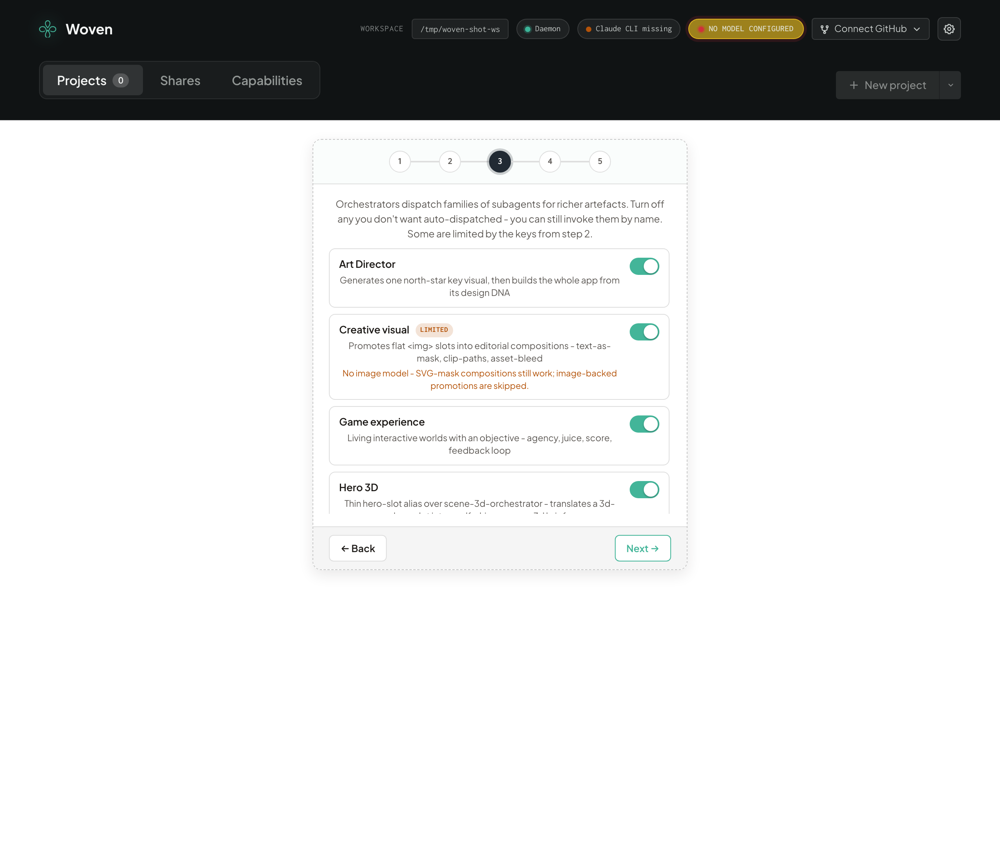

Rows whose pipeline depends on a key you haven't set in Step 2 (photography and illustration need an image model; audio-bearing families need an audio key) are shown as **limited** with a short note about what's missing. Nothing here blocks project creation; if in doubt, leave the defaults and click **Next →**.

---

## 8. Step 4 · install local skills

The wizard's **Step 4 · Local skills** lists on-demand tools the daemon installs for you. **Four are required gates** (each shows a red **REQUIRED** badge until present) and the **+ New project** button stays disabled until all four are installed:

| Skill            | Auto-install runs                | Needs    | What breaks without it                                          |
| ---------------- | -------------------------------- | -------- | -------------------------------------------------------------- |
| **rembg**        | `pip3 install --user rembg`      | Python   | foreground asset generation falls over at the cutout stage (~170 MB model first run) |
| **cloudflared**  | `brew install cloudflared`       | Homebrew | Share mode can't open a public review tunnel                   |
| **glslang**      | `brew install glslang`           | Homebrew | the shader lint can't catch real GLSL compile errors          |
| **shader-verify**| npm install + Chromium download  | Node.js  | no headless render-check for compiles-but-blank shaders (~150 MB Chromium) |

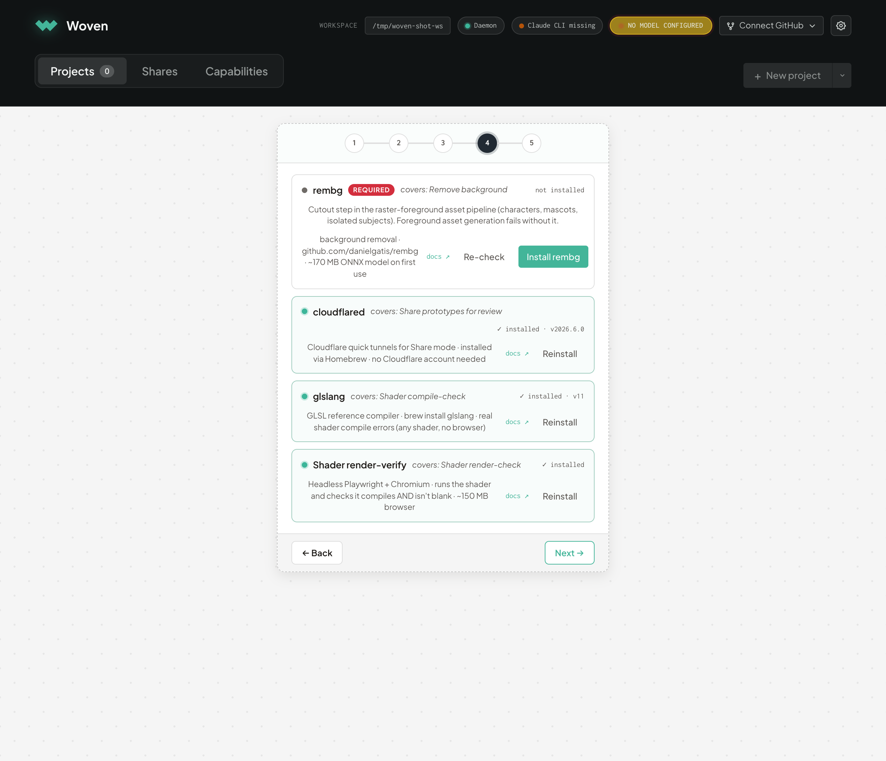

Opening Step 4 **starts the installs automatically** - each row shows a spinner and flips green as it lands (`shader-verify` is the slowest, it pulls a Chromium; give it a minute or three). The commands above are exactly what runs under the hood. The two Homebrew skills need **[Homebrew](https://brew.sh)** and `shader-verify` needs **[Node.js](https://nodejs.org)** already on your machine; a row whose prerequisite is missing skips auto-install and shows a hint + manual **Install** button - install the prereq, then hit **Re-check**.

A fifth skill, **whisper-cpp** (offline transcription for User Testing), is **optional**, install it later from the gear icon → Settings if you use that feature.

Once the required steps are satisfied, **Step 5 · Done** confirms you're set (**"All set!"** when a CLI is connected, or **"Continue without agents"** if you finished on a key alone). It also carries the optional **User testing mode** toggle. Click **Got it** to dismiss the card, and the **+ New project** button lights up.

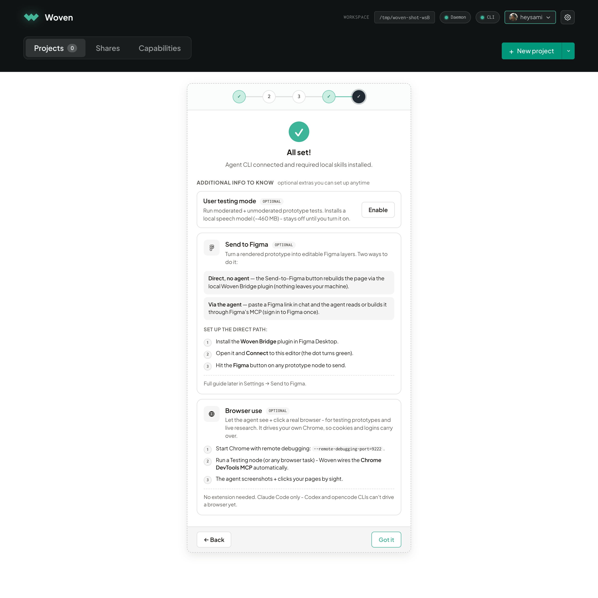

---

## 9. Create your first project

Once a model is configured and the four required local skills are installed, the top-right warning pill disappears, the daemon + CLI chips both go green, and the **+ New project** button lights up. The header carries tabs for **Projects** (your gallery), **Shares**, and **Capabilities** (a bundled reference for the orchestrators, skills, subagents, and node kinds the editor ships with), reachable from anywhere on the landing.

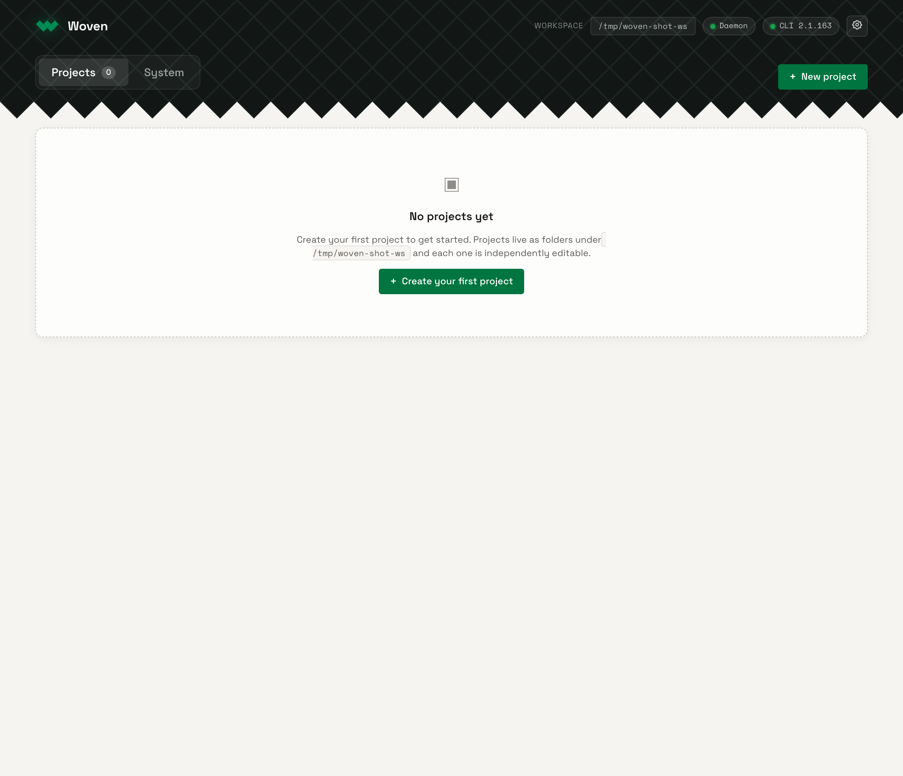

Click **+ New project** (or **+ Create your first project** in the empty state - the caret next to it also offers **From GitHub…** to clone an existing repo). The new-project modal opens:

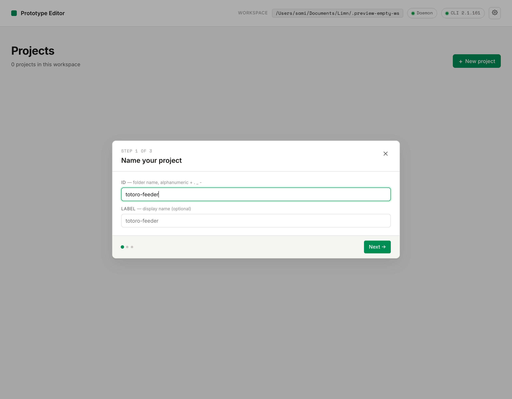

It has three things on it:

- **Project name** - type a folder-safe id (alphanumeric + `.` `_` `-`); the modal echoes the slug it will use.
- **Export folder** (optional) - where per-asset Export (the ⤓ on a selected node) drops bundles. On macOS a **Pick…** button opens Finder; you can also change this later from the **Exports** button in the workflow toolbar.
- **Start from the template design system** (toggle, off by default) - seed a tokenized component library you can recolour, round, and retype.

With the toggle **off**, click **+ Create** and you land straight on a clean workflow canvas - no scope picker, no multi-step wizard. The earlier "Blank / Quick designs / Design system / PRD only / Full guided / Custom" branching was removed; every fresh project starts blank and you tell the agent what you want from chat. Need one of the old guided runs? Just ask the agent in plain English on the next screen ("brainstorm three design directions", "write a PRD first", "do the full guided flow", …) and the orchestrator skill picks the right stages.

With the toggle **on**, the button reads **Customize →** and advances to a wider **design-system customizer** step - a live preview where you tune colour, roundness, type, and spacing before the project is created with that tokenized DS baked in.

---

## 10. Open the workflow and send your first prompt

The editor drops you into **workflow mode**. The left sidebar is the **Library** of node types (basic tools, asset generators, iterators, and more…). In the middle of the empty canvas, the editor shows a **"Your workflow is empty"** card with a composer right where you need it. No menus to open, no drawers to expand.

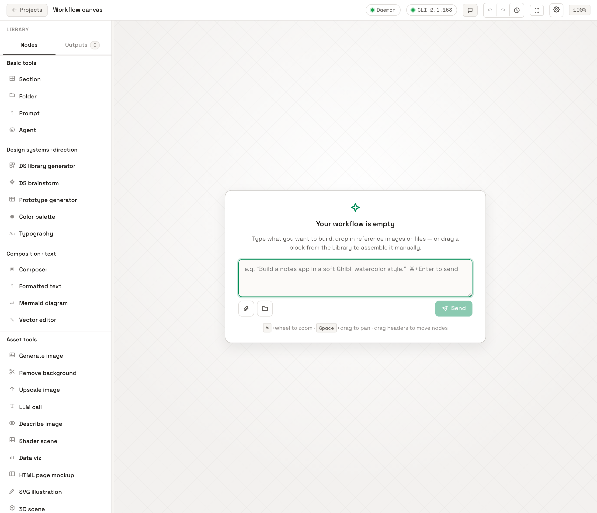

Type your prompt into the composer. The agent has read/edit/bash access to your project root and will scaffold the prototype from scratch. For this walkthrough we'll use:

> `create a ghibli themed mobile app to feed totoro`

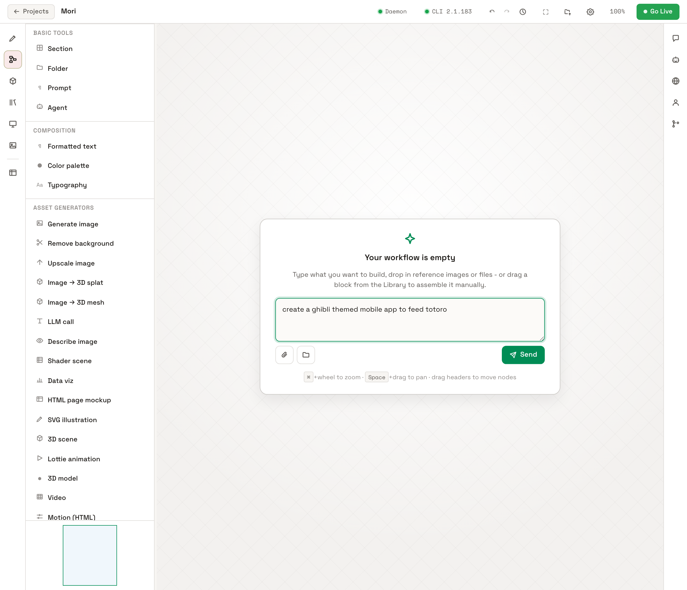

Press **⌘/Ctrl + Enter** (or click **Send**) and the agent gets to work, generating the design system, scaffolding pages, dispatching asset jobs, and wiring everything together as nodes on the canvas in real time.

---

## 11. The final prototype

After the run finishes (marked **Done** at 28 turns), the workflow canvas holds every step that produced the app: a column of **Generate image** nodes (one per painted asset: Totoro under the camphor tree, the pantry shelf, the ambient leaf borders, each food cutout…), with **Remove background** nodes cleaning the food sprites into transparent PNGs, all feeding the live phone-mockup of **Totoro's Wood** on the right. The chat drawer records how it was built and can be reopened to continue the same session.

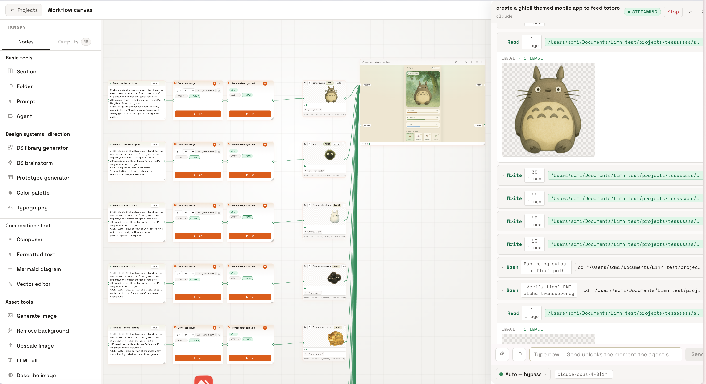

The chat summary shows the discipline the build followed. The palette (`#f4ece0 / #fbf6ec / #3a3128 / #8a7d6b / #e3d6c2 / #5b8c6e`), Fraunces display + Inter body, and a cream-humanist × cottagecore register were **locked from the approved art-direction plate** and held immutable through the build. The orchestrators ran in order: **art-director** (north-star plate + contract) → **illustration** (committed the Ghibli watercolor register, rejecting the 3D-mascot default) → **visual** (12 painted assets + the ambient-leaves loop) → **game-experience** (the playable feed loop) → **interactive-polish** (staggered chrome settle, watery meter rise, journal reveal). Click **▶ Run** on any node to regenerate a single asset without redoing the flow.

### What the agent generated from a single prompt

The one-line prompt, *"build a ghibli themed mobile app to feed totoro"*, produced a four-tab app — **Wood · Feed · Pantry · Journal** — with a hand-painted watercolor palette carried across every screen:

| Wood · visit Totoro | Pantry · what you've gathered | Journal · your days together |
| :---: | :---: | :---: |
| 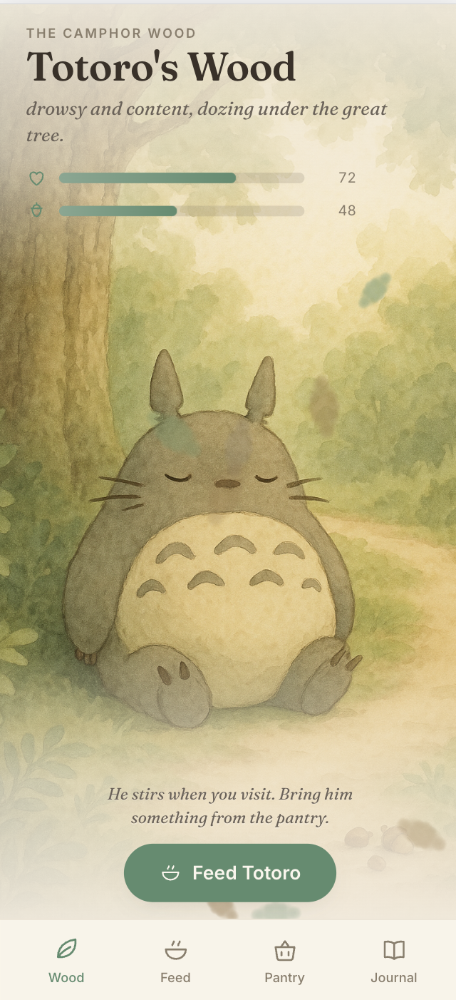 | 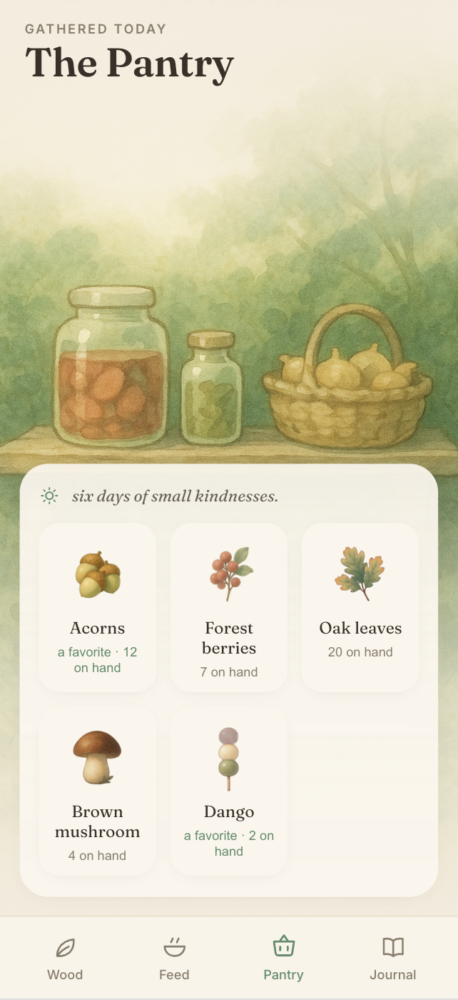 | 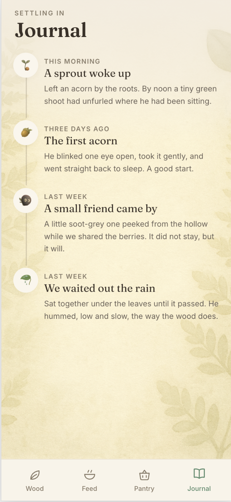 |
| Totoro dozes under the great camphor tree; two meters (a **heart** at 72, an **acorn** at 48) sit above a **Feed Totoro** button, with the line "He stirs when you visit. Bring him something from the pantry." | **The Pantry** — *six days of small kindnesses.* A grid of gathered foods (**Acorns · Forest berries · Oak leaves · Brown mushroom · Dango**) with live counts and a *favorite* tag on the ones Totoro loves most. | **Journal** — a settling-in timeline that writes itself as you play: *A sprout woke up · The first acorn · A small friend came by · We waited out the rain*, each with a soft-grey soot-sprite or acorn glyph. |

The fourth tab, **Feed**, is the playable loop: drag a food from your pantry onto Totoro and his meters respond. Bottom-tab navigation, the warm-paper background, sage-green accent, and watercolor illustration style carry across every screen, all inferred from the single prompt.

---

## Troubleshooting

| Symptom                                              | Fix                                                                                                    |
| ---------------------------------------------------- | ------------------------------------------------------------------------------------------------------ |
| Top-right pill stays red after pasting a key         | Click the **gear icon → Test** on that provider row in Settings to verify the key.                     |
| **Claude CLI missing** chip is amber                 | `which claude`. If empty, run `npm install -g @anthropic-ai/claude-code` then `claude login`. (Shows **Codex CLI missing** or **opencode CLI missing** if that's your preferred CLI, install via `npm install -g @openai/codex` / `brew install sst/tap/opencode` then its login command.) |
| **Daemon down** chip is red                          | The Python server crashed or was stopped. Re-run `python3 editor/serve.py` from the repo root.         |
| Port 5731 already in use                             | Set a different port: `EDITOR_PORT=5740 python3 editor/serve.py`.                                      |
| Image / video / SVG nodes fail with "no API key"     | Open **Settings (gear)** and add the relevant provider key (see [Step 2](#6-step-2--add-asset-provider-keys-image--video--svg)). |

---

## Where things live on disk

In multi-project mode the workspace dir (`TH_WORKSPACE_DIR`) is **separate from the cloned repo** and holds only the daemon-managed data below. (If you run from the repo root with no workspace dir, this same `projects/` tree lives alongside the repo's own `editor/`, `PROTOTYPE.md`, `design-library/`, etc.)

```
<workspace-dir>/
├── workspace.json                          # project registry (auto-managed)
├── shares.json                             # live-share registry (auto-managed)
├── .trash/                                 # recoverable deleted projects (Housekeeping → empty)
└── projects/
    └── <project-id>/
        ├── source/main/                    # the generated prototype HTML/CSS/JS (per branch; default "main")
        ├── editor/data.js                  # canvas state (frames, nodes, arrows)  ·  + chat.jsonl
        ├── workflow/workflow.json          # workflow graph  ·  + runs/ + views/ snapshots
        ├── design-systems/<ds-id>/         # design systems you build for this project (empty until then)
        └── .history/, .thumbnail*, …       # edit history + gallery metadata (auto-managed)

~/.test-harness/media-config.json           # your provider API keys (mode 0600, per-user)
```

(`fonts/` and `.system-chats/` also appear at the workspace root once you upload a font or use the Capabilities agent.)

That's it. You're set up.
